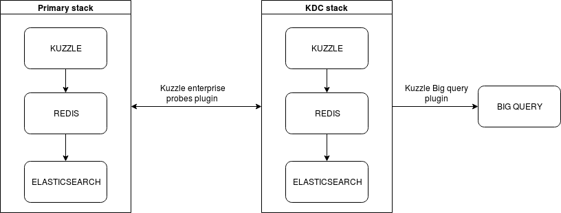

# Kuzzle, BiqQuery and Data-studio dashboard

Today we want to create a dashboard with Kuzzle and Google Data-studio. As you know Data-studio needs to manage data source and we will use BigQuery as data warehouse.

A common need when using Kuzzle in production, is to have insights about it and perform analytics on events occurring during an instance's lifecycle. A common supply for this need is to allow attaching probes to the production instance and send the events somewhere. At Kuzzle, we use Kuzzle to monitor Kuzzle.

 

KDC (for Kuzzle Data Collector) is plugged to the primary stack and wait for configured events occurs. 
When dones, it sends datas to BigQuery through another plugin. And finally we just have to put these datas in a data source and use them in Data-studio.

In a precedent article, I have explained that we have an IoT board installed in our office that sends data about some weather captures and detected motions. Today for training purpose, imagine we want monitor only light level and view them in an awesome chart in Data-studio.

What we want is to send datas catched by the probes plugin to BigQuery appropriate table and construct our graph with these datas.

## 1- Docker-compose and configuration files

Like said previously we need 2 Kuzzle stacks and a bunch of plugins to be configured in harmony to gets one big stack ready to blow up our datas !

For orchestrating all of that, I write a docker-compose file :

```yaml
version: '2'

services:
  kuzzle:
    image: kuzzleio/kuzzle
    ports:
      - "7512:7512"
    volumes:
      - "./../kuzzle-enterprise-probe-listener/:/var/app/plugins/enabled/kuzzle-enterprise-probe-listener/"
      - "./docker-compose/kuzzlerc:/etc/kuzzlerc"
    depends_on:
      - redis
      - elasticsearch
    environment:
      - kuzzle_services__db__client__host=http://elasticsearch:9200
      - kuzzle_services__internalCache__node__host=redis
      - kuzzle_services__memoryStorage__node__host=redis
    

  redis:
    image: redis:3.2

  elasticsearch:
    image: kuzzleio/elasticsearch:5.4.1
    environment:
      - cluster.name=kuzzle
      # disable xpack
      - xpack.security.enabled=false
      - xpack.monitoring.enabled=false
      - xpack.graph.enabled=false
      - xpack.watcher.enabled=false

  kdc-kuzzle:
    image: kuzzleio/kuzzle
    ports:
      - "7515:7512"
      - "9229:9229"
    cap_add:
      - SYS_PTRACE
    depends_on:
      - kdc-redis
      - kdc-elasticsearch
    volumes:
      - "./:/var/app/plugins/enabled/kuzzle-enterprise-probe/"
      - "./../kdc-bigquery-connector/:/var/app/plugins/enabled/kdc-bigquery-connector/"
      - "./docker-compose/kdcrc:/etc/kuzzlerc"
    environment:
      - kuzzle_services__db__client__host=http://kdc-elasticsearch:9200
      - kuzzle_services__internalCache__node__host=kdc-redis
      - kuzzle_services__memoryStorage__node__host=kdc-redis
      - NODE_ENV=production

  kdc-redis:
    image: redis:3.2

  kdc-elasticsearch:
    image: kuzzleio/elasticsearch:5.4.1
    environment:
      - cluster.name=kuzzle
      # disable xpack
      - xpack.security.enabled=false
      - xpack.monitoring.enabled=false
      - xpack.graph.enabled=false
      - xpack.watcher.enabled=false

```

In this docker-compose file, we have all our services needed running, each with their plugins and configuration files mounted in volumes.

So, it's time to see these configurations files. The first one will be the Kuzzle listener stack :

```JSON
{
  "plugins": {
   "kuzzle-enterprise-probe-listener": {
      "threads": 1,
      "probes": {
        "probe_watcher_1": {
          "type":"watcher",
          "index": "iot",
          "collection": "device-state",
          "filter": {
            "equals": {
              "device_type": "light_sensor"
            }
          },
          "action": "create",
          "collects": [
            "state.level"
          ]
        }
      }
    }
  }
}
```

It describe all the probes plugged to the listenner, here only one for light level. We use a watcher probes waiting for document creation in the ```iot``` index and in ```device-state``` collection. We also add a filter to catch only document with field "device_type" equals to "light_sensor"
When this event happen, the probes will only collect datas that interresting us (```state.level```) and send them to the KDC stack.

Now, the KDC stack configuration :

```JSON
{
  "plugins": {
    "kuzzle-enterprise-probe": {
      "storageIndex": "iot",
      "probes": {
        "probe_watcher_1": {
          "type":"watcher",
          "index": "iot",
          "collection": "device-state",
          "filter": {
            "equals": {
              "device_type": "light_sensor"
            }
          },
          "action": "create",
          "collects": [
            "state.level"
          ]
        }
      }
    },
    "kdc-bigquery-connector": {
      "projectId": "local-receiver-192608",
      "dataSet": "probes_iot",
      "credentials": {
        //[...] put your google's credentials here
      },
      "probes": {
        "probe_watcher_1": {
          "timestamp": "true",
          "type": "watcher",
          "tableName": "light_sensor",
          "schema": {
            "fields": [
              {
                "name": "level",
                "type": "FLOAT",
                "mode": "NULLABLE"
              }
            ]
          }
        }
      }
    }
  }
}
```

As you can see, the probes plugin configuration parts is exactly the same that for configuring the plugin on the listenner stack.
To the following, we add the BigQuery plugins configuration. We also need to add our configured probes to this plugin. But this time with the schemas of our BigQuery tables.
I add ```"timestamp":"true"```, with that option the plugin will automatically add the timestamp for each document collected.

## 2- BigQuery and Data-studio

Assuming you have already configured your google account for using BigQuey, you have to create a new project in BigQuery console.


