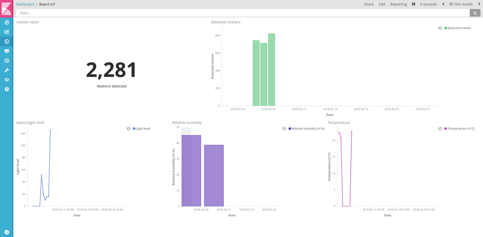

# How to create a dashboard with Kuzzle and Kibana



Having tons of datas is awesome but visualizing them and having them say something is better. That's why I have decided to write a tutorial about how to dashboard with Kuzzle and Kibana.

 

[Kuzzle](http://kuzzle.io/) is an open-source self-hostable backend, ready to use for power web, mobile and IoT applications. It allows you to drastically reduce your developpement time and give you tools for real-time datas management, geofencing and others extras features.

Today, our goal is to make a beautiful dashboard about IoT datas collected through a board installed in our office. This board capture light level, humidity, temperature and detected motions for demonstration and testing. It's a great use case for tutorials and I've decided to create an elastic-search docker image with all our datas to make it easier to follow. (you can see more informations about this image [here]).

After reading this article, we will have a dashboard showing you detected motions over the time.

First of all, you should install docker and docker-compose.


## 1- Docker compose and configurations file

To start we have to write a docker-compose file (in yaml) to launch a stack with Kuzzle, Elastic-search and Kibana. Create a file called `docker-compose.yml`.

To begin we have to add the Kuzzle service in this file. 

```yaml
version: '2'

services:
  kuzzle:
    image: kuzzleio/kuzzle
    ports:
      - "7512:7512"
    cap_add:
      - SYS_PTRACE
    depends_on:
      - redis
      - elasticsearch
    environment:
      - kuzzle_services__db__client__host=http://elasticsearch:9200
      - kuzzle_services__internalCache__node__host=redis
      - kuzzle_services__memoryStorage__node__host=redis
      - NODE_ENV=production
```
For internal usage, Kuzzle need Redis. Add this service to the following of our docker-compose file :

```yaml
  redis:
    image: redis:3.2
```
Also, we need elasticsearch to store the data. For the goal of this tutorial, we use a pre-build image with some data already loaded :

```yaml
  elasticsearch:
    image: njuelle/es-tuto-kuzzle-kibana
    environment:
      - cluster.name=kuzzle
      - xpack.security.enabled=false
      - xpack.monitoring.enabled=false
      - xpack.graph.enabled=false
      - xpack.watcher.enabled=false
      - http.host=0.0.0.0
      - transport.host=0.0.0.0
      - "ES_JAVA_OPTS=-Xms1g -Xmx1g"
```

Now we have a full Kuzzle backend stack ready to blaze your datas ! Please don't forget, we are here to make an awesome dashboard. Then add Kibana service to your `docker-compose.yml`

```yaml
  kibana:
    image: docker.elastic.co/kibana/kibana:5.4.1
    environment:
      - SERVER_HOST=0.0.0.0
    volumes:
      - ./kibana.yml:/usr/share/kibana/config/kibana.yml
    ports:
      - 5601:5601
```

If you are a fine observer you would have seen there is a volume mounted for configuring Kibana. What we need now is to create a file `kibana.yml` and put some lines in it :

```yaml
server.name: kibana
server.host: "0"
elasticsearch.url: http://elasticsearch:9200
```

Now you can run this docker-compose file in your favorite terminal

```bash
$ docker-compose up
```
If everything is correct you should now see the entire logs for all services running. You can check if kuzzle is working correctly by browsing http://localhost:7512?pretty=true. Kuzzle should respond with a list of the existing routes.

Your stack is ready and at this stage you can go to Kibana console to create amazing visualizations !

## 2- Configuring Kibana and Kuzzle

Kuzzle is based on documents collections database and our datas are articulate in this way :

```json
{
    "_index":"iot",
    "_type":"device-state",
    "_id":"AWFSDI8RAUgq-wTF-Lwg",
    "_score":1,
    "_source": {
        "device_id":"motion_00000000c9591b74",
        "device_type":"motion-sensor",
        "partial_state":false,
        "state": {
            "motion":true,
        },
        "_kuzzle_info": {
            "author":"iot-device",
            "createdAt":1517834432225,
            "updatedAt":null,
            "updater":null,
            "active":true,
            "deletedAt":null
        }
    }
}
```
We can notice we have and index called `iot` and a collection called `device-state`. Information interesting us are stored in the `state` object. Timestamp dates are stocked in `_kuzzle_info` metafield object of our document. 

Before creating charts with Kibana, we have to configure it. Browse http://localhost:5601 and you will get to Kibana management page.

We need to tell Kibana where our dates and times are stocked. Click on "Advanced Settings" link and find the "metaFields" input, then on the edit button and add `_kuzzle_info.createdAt`, and don't forget to save your changes.


Right now we have to give the index name we want to use to Kibana.
Click on "Index Patterns" and type `iot` in the input text. Kibana will automatically find the time based field we just added. Click on "Create" button to validate.


Kibana will parse every searchable or aggreagatable fields and show you these fields. 

The next step is to add a scripted field in kibana. Remember we want to visualize detected motions captured by our sensor, but this sensor returns a boolean when it detects mouvements.

```json
"state": {
  "motion":true
}
```

Only numbers fields can be aggreagatable so we need to create a scripted field.

Click on "scripted fields" tabs and on the "Add Scripted Field" button. Give a name to your new field, `detected motions` seems nice.
Kibana uses Painless script, that sounds good to our ears. Do not touch others configurations inputs but go directly to "Script" textarea and type :

```
doc['state.motion'].value ? 1 : 0
```


This will create a new aggreagatable number field parsing all documents in our index with the boolean field `state.motion` and return 1 or 0 depending on his value.

Save our new scripted field. We just finished configuring !

## 3- Create visualizations and dashboard

This is the fun part of this tutorial and that's why you're here ! We're going to create our first graph, ready? Let's go!

Click on "Visualize" button on left side menu and click on "Create a visualization".

We want our first graph to be a bar graph of detected motions, so choose "Vertical Bar" and your index by clicking on "iot".

Kibana is a great tool for visualizing data in real time. In this tutorial, for easy comprehension we will use only an extract of our IoT sensor datas for a few days. First thing to do is to select a time period. Click on time range button on the top right corner (by default it's set to "Last 15 minutes").
Now click on "Absolute" and choose a range in the dates pickers. The dump we use start on 02-05-2018 and ends on 02-07-2018. Pick these dates and validate them ("Go" button).


We have to configure our graph. First unfold the "Y-axis" menu and  choose an aggregation. Select "Sum" in the dropdown menu. Next we have to choose the field we want to aggregate. Find the `detected motions` field and select it. It's possible to enter a custom label to embellish our graph. Do not deprive us and type what you want in the the text box meant for that purpose. This is the text legend of our Y axis chart.


It's time to set up the X axis, we want to sort our detected motions by date.
Click on the "X-Axis" button and select "Date Histogram". Kibana automatically select date field but we have to choose an interval. Pick a hourly interval in the dropdown menu. And as previously type a custom label, for exemple "Date".


Now click on the "Apply change" button  to see our beautiful graph.


Save your new chart by clicking on the save button on the top menu, give it a name and validate.

And to finish we will add this super graph to a dashboard.
Click on the "Dashboard" button on the left side menu and click on the appropriate button to create a new dashboard.
Like Kibana saids, "This dashboard is empty. Let's fill it up!". So click on the "Add" link on the top menu.


Choose the visualization we just created and it will be added to our dashboard ! Here we are, we have a dashboard with a beautiful graph showing detected motions of our IoT board over a time period!

Kibana give you the possibility to share your dashboard, with an URL that you can send to people or directly on a web page with an iframe.

Feel free to play and experiment by yourself with our datas to add other graphs to this dashboard :-)

