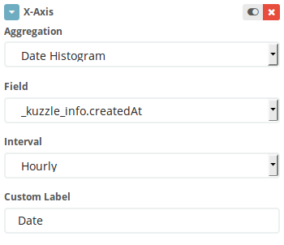

# How to a create dashboard with Kuzzle and Kibana

Having tons of datas is cool but visualizing them and make them say something is better, that's why I decide to wrote a tutorial about how to dashboard with Kuzzle and Kibana.

Kuzzle is an open-source self-hostable backend, ready to use for power web, mobile and IoT applications. Allows you to drastically reduce your developpement time and give you tools for real-time datas management, geofencing and others extras features.

Today, we are here for making a beautiful dashboard about IoT datas collected through a board installed in our office. This board, for demonstrating and testing, capture light level, humidity, temperature and detected motions. It's a great use case for a tutorial and I decide to create an elastic-search docker image with all our datas for making easier to follow this tutorial.

After reading this article, we will have a dashboard who show you detected motions over the time.

Before start, to continue you should install docker and docker-compose.


## 1- Docker compose and configurations file

First we have to write a docker-compose file (in yaml) to launch a stack with Kuzzle, Elastic-search and Kibana. So, create a file called `docker-compose.yml`.

For beggining we have to add some services in this file, we need Kuzzle, Redis and Elastic-search :

```yaml
version: '2'

services:
  kuzzle:
    image: kuzzleio/kuzzle
    ports:
      - "7512:7512"
    cap_add:
      - SYS_PTRACE
    depends_on:
      - redis
      - elasticsearch
    environment:
      - kuzzle_services__db__client__host=http://elasticsearch:9200
      - kuzzle_services__internalCache__node__host=redis
      - kuzzle_services__memoryStorage__node__host=redis
      - NODE_ENV=production

  redis:
    image: redis:3.2

  elasticsearch:
    image: njuelle/es-tuto-kuzzle-kibana
    environment:
      - cluster.name=kuzzle
      - xpack.security.enabled=false
      - xpack.monitoring.enabled=false
      - xpack.graph.enabled=false
      - xpack.watcher.enabled=false
      - http.host=0.0.0.0
      - transport.host=0.0.0.0
      - "ES_JAVA_OPTS=-Xms1g -Xmx1g"
```

Now we have a full Kuzzle backend stack ready to blaze your datas ! But don't forget, we are here for making an awesome dashboard, now add Kibana service to your `docker-compose.yml`

```yaml
kibana:
    image: docker.elastic.co/kibana/kibana:5.4.1
    environment:
      - SERVER_HOST=0.0.0.0
    volumes:
      - ./kibana.yml:/usr/share/kibana/config/kibana.yml
    ports:
      - 5601:5601
```

If you are an observer you see there is a volume mounted for configuring Kibana. What we need now is to create a file `kibana.yml` and put some lines in it :

```yaml
server.name: kibana
server.host: "0"
elasticsearch.url: http://elasticsearch:9200
xpack.monitoring.ui.container.elasticsearch.enabled: true
```

Now you can run this docker-compose file in your favorite terminal

```bash
$ docker-compose up
```
If everything is correct you can see all logs for all services running. You can check if kuzzle is working correctly by browsing http://localhost:7512?pretty=true, Kuzzle will respond you with a list of the existing routes.

Your stack is ready and we can go to Kibana console for create amazing visualizations !

## 2- Configuring Kibana and Kuzzle

Kuzzle is based on documents collections database and our datas are articulate in this way :

```json
{
    "_index":"iot",
    "_type":"device-state",
    "_id":"AWFSDI8RAUgq-wTF-Lwg",
    "_score":1,
    "_source": {
        "device_id":"motion_00000000c9591b74",
        "device_type":"motion-sensor",
        "partial_state":false,
        "state": {
            "motion":true,
        },
        "_kuzzle_info": {
            "author":"iot-device",
            "createdAt":1517834432225,
            "updatedAt":null,
            "updater":null,
            "active":true,
            "deletedAt":null
        }
    }
}
```
We can notice that we have and index called `iot` and a collection called `device-state`. Informations that interests us is store in the `state` object. Timestamp dates are stocked in `_kuzzle_info` metafield object of our document. 

Before create graphs with Kibana, we have to configure it. Browse http://localhost:5601 and you will arrive to the management page of Kibana.

We need to tell Kibana where our dates and times are stocked, click on "Advanced Settings" link and find the "metaFields" input, click on the edit button and add `_kuzzle_info.createdAt`, don't forget to save your changes.


At this time we have to give to Kibana the index name we want to use. Click on "Index Patterns" and type `iot` in the input text. Kibana will automatically find the time based field we just added. Click on "Create" button to validate.


Kibana will parse every searchable or aggreagatable fields and show you these fields. 

Next step we have to add a scripted field in kibana, remember we want to visualize detected motions captured by our sensor, but this sensor return a boolean when he detect mouvement. Only numbers fields can be aggreagatable so we need to create a scripted field.

Click on "scripted fields" tabs and on the "Add Scripted Field" button. Give a name to your new field, `detected motions` seems nice.
Kibana use Painless script, that sound good in our ears. so don't touch others configurations inputs and go directly to "Script" textarea and type :

```
doc['state.motion'].value ? 1 : 0
```


This will create a new aggreagatable number field that parse all documents in our index with the boolean field `state.motion` and return 1 or 0 depends on his value.

Save our new scripted field and we just finishing configuring.

## 3- Create visualizations and dashboard

It's the fun part of this tutorial and that's why you are here ! We will create one graph with the datas previously added, ready? let's go!

Click on "Visualize" button on left menu and click on "Create a visualization".

Our first graph will be a bar graph of detected motions, so choose "Vertical Bar" and choose your index by clicking on "iot".

Kibana is a great tool for visualizing data in real time, but in this tutorial, for easy comprehension we use just an extract of our IoT sensor datas on fews days. First thing to do is to select a time period. Click on time range button on the top right corner (by default it's set to "Last 15 minutes"), now click on "Absolute" and choose a range in the dates pickers. The JSON dump we use start to 02-05-2018 and end to 02-07-2018, so pick these dates and validate.


We need to configure our graph, first, the Y axis :
Unfold the "Y-axis" menu and we have to choose an aggregation, select "Sum" in the dropdown menu. Next we have to choose the field we want to aggregate. Find the `detected motions` field and select it. It's possible to enter a custom label to embellish our graph, do not deprive us and type what you want in the the text box meant for that purpose, this is the text legend of our Y axis graph.


It's time to setup the X axis, we want to sort our detected motions by date.
Click on the "X-Axis" button and select "Date Histogram". Kibana automatically select the date field but we have to choose an interval, pick a hourly interval in the dropdown menu. And like previously type a custom label, for exemple "Date".



Now click on the "Apply change" button  to see our beautiful graph.


Save your new graph by clicking on the save button on the top menu, give it a name and validate.

And now, the final step, we will add our super graph in a dashboard. Click on the "Dashboard" button on the left side menu and click on the appropriate button to create a new dashboard.
Like Kibana said, "This dashboard is empty. Let's fill it up!" so click on the "Add" link on the top menu


Choose the visualization we just created and it will be added to our dashboard! Here we are, we have a dashboard with a beautiful graph showing detected motions over a time period!

Feel free to play and experiment by yourself with our datas to add anothers graph on this dashboard :)

