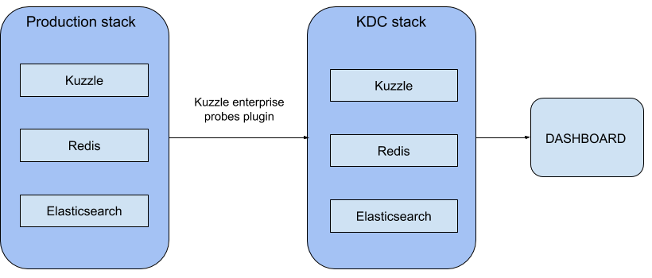
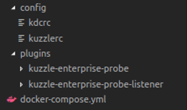
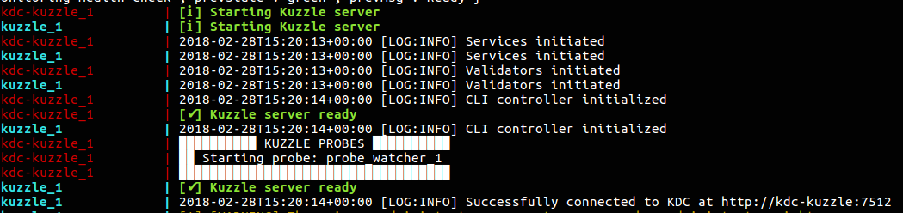

# Visualizing Data with Kuzzle Analytics - part 1


Having tons of data is awesome but visualizing them and getting them to tell you something meaningful is even cooler. That's why I've decided to write a series of 3 articles on how to build a monitoring dashboard using Kuzzle. In the first article we will describe  how to configure Kuzzle for analytics. In the second article we will deal with how to visualize data using Kibana. Finally, , in the third article we will use Google Data Studio to visualize our data.  


[Kuzzle](http://kuzzle.io/) is an open-source self-hostable backend solution that can power web, mobile and IoT applications. It allows you to drastically reduce your development time and take advantage of built-in features like real-time data management and geofencing, among others.

Our goal is to build a beautiful dashboard based on the IoT data collected from a custom multi-sensor device that detects luminosity, humidity, temperature and motion. Kuzzle built this device to demo Kuzzle's core features, you may have seen it at CES. This device was connected to an on-premise Kuzzle production stack and sat in our office for a period of 5 days, where it captured all our kooky antics and sent this data to Kuzzle using the MQTT protocol. 

A common requirement when using Kuzzle in production, is to collect and analyse data that it is processing.  This can be done thanks to Kuzzle Analytics, which allows you to collect and route data to other applications. In our case, we have a multi-sensor device connected to our Kuzzle production stack, which in turn is connected to a Kuzzle Data Collector (KDC) stack. 



For simplicity, we use the name KDC to represent a stack that uses our kuzzle-enterprise-probes plugin to collect data. 


The probes plugin can manage 3 types of probes :
 - ```monitor``` probes are basic event counters used to monitor Kuzzle activity.
 - ```counter``` probes aggregate multiple events into a single measurement.
 - ```watcher``` probes watch documents and messaging activity, counting them or retrieving part of their content.

In our scenario, we want the Kuzzle production stack to send data to our KDC stack anytime a motion is detected on the multi-sensor device. Probes allow us to detect this activity and push it to the KDC stack.

At the end of these 3 tutorials, we will have created a dashboard that shows the office's activity (detected motions) over time.

## 1- Preparing your files

Let's get started. First of all, you will need docker and docker-compose. If you don’t already have it,  you can check these tutorials : [Install Docker](https://docs.docker.com/install/) and [Install Docker Compose](https://docs.docker.com/compose/install/).

Now we need to configure our two Kuzzle stacks and a bunch of plugins so that we can start crunching data  !

Each stack needs to have the  kuzzle-enterprise-probes plugin configured Here’s an overview of our directory structure:



For the first step we have to write a Docker Compose file that will launch our Kuzzle production stack. Create a file called `docker-compose.yml`.

Now add the Kuzzle service in this file. Note that we use environment variables to configure the Elasticsearch connection. We also expose port 7512 which will allow clients to communicate with the service through your docker host.

```yaml
version: '2'

services:
  kuzzle:
    image: kuzzleio/kuzzle
    ports:
      - "7512:7512"
    cap_add:
      - SYS_PTRACE
    depends_on:
      - redis
      - elasticsearch
    environment:
      - kuzzle_services__db__client__host=http://elasticsearch:9200
      - kuzzle_services__internalCache__node__host=redis
      - kuzzle_services__memoryStorage__node__host=redis
      - NODE_ENV=production
    volumes:
      - "./plugins/kuzzle-enterprise-probe-listener/:/var/app/plugins/enabled/kuzzle-enterprise-probe-listener/"
      - "./config/kuzzlerc:/etc/kuzzlerc"
```
Likewise we use volumes to mount the plugin and his configuration file into the Kuzzle service.

Next we need to add Redis (used internally by Kuzzle) to the docker-compose.yml file. Add the following config:

```yaml
  redis:
    image: redis:3.2
```
We will also need Elasticsearch to store the data collected from our custom multi-sensor device:

```yaml
  elasticsearch:
    image: kuzzleio/elasticsearch:5.4.1
    environment:
      - cluster.name=kuzzle
      - xpack.security.enabled=false
      - xpack.monitoring.enabled=false
      - xpack.graph.enabled=false
      - xpack.watcher.enabled=false
      - http.host=0.0.0.0
      - transport.host=0.0.0.0
      - "ES_JAVA_OPTS=-Xms1g -Xmx1g"
```

We have now configured the Kuzzle production stack !

Now let’s add the KDC stack to our docker-compose file :

```yaml
  kdc-kuzzle:
    image: kuzzleio/kuzzle
    ports:
      - "7515:7512"
      - "9229:9229"
    cap_add:
      - SYS_PTRACE
    depends_on:
      - kdc-redis
      - kdc-elasticsearch
    volumes:
      - "./plugins/kuzzle-enterprise-probe:/var/app/plugins/enabled/kuzzle-enterprise-probe/"
      - "./config/kdcrc:/etc/kuzzlerc"
    environment:
      - kuzzle_services__db__client__host=http://kdc-elasticsearch:9200
      - kuzzle_services__internalCache__node__host=kdc-redis
      - kuzzle_services__memoryStorage__node__host=kdc-redis
      - NODE_ENV=production
    

  kdc-redis:
    image: redis:3.2

  kdc-elasticsearch:
    image: kuzzleio/elasticsearch:5.4.1
    environment:
      - cluster.name=kuzzle
      # disable xpack
      - xpack.security.enabled=false
      - xpack.monitoring.enabled=false
      - xpack.graph.enabled=false
      - xpack.watcher.enabled=false
```
Kuzzle stores data in document collections within an index. Below is an example document that represents a single motion capture:


```json
{
    "_index":"iot",
    "_type":"device-state",
    "_id":"AWFSDI8RAUgq-wTF-Lwg",
    "_score":1,
    "_source": {
        "device_id":"motion_00000000c9591b74",
        "device_type":"motion-sensor",
        "partial_state":false,
        "state": {
            "motion":true,
        },
        "_kuzzle_info": {
            "author":"iot-device",
            "createdAt":1517834432225,
            "updatedAt":null,
            "updater":null,
            "active":true,
            "deletedAt":null
        }
    }
}
```

Notice that this document is stored in a collection called `device-state`, in an index called `iot`. The data we are interested in is stored in the `state` object, while metadata such as timestamps are stored in the `_kuzzle_info` document.

At this time, we need to create the first configuration file to tell the kuzzle-enterprise-probe-listener plugin what to collect. Name it ```kuzzlerc``` and add these lines :

```json
{
  "plugins": {
    "kuzzle-enterprise-probe-listener": {
      "threads": 1,
      "probes": {
        "probe_watcher_1": {
          "type":"watcher",
          "index": "iot",
          "collection": "device-state",
          "filter": {
            "equals": {
              "device_type": "motion-sensor"
            }
          },
          "action": "create",
          "collects": [
            "state.motion"
          ]
        }
      }
    }
  }
}
```

Now on the KDC stack we need to configure the kuzzle-enterprise-probe to collect the data. Create another configuration file and call it  ```kdcrc``` : 

```json
{
  "plugins": {
    "kuzzle-enterprise-probe": {
      "storageIndex": "iot",
      "probes": {
        "probe_watcher_1": {
          "type":"watcher",
          "index": "iot",
          "collection": "device-state",
          "filter": {
            "equals": {
              "device_type": "motion-sensor"
            }
          },
          "action": "create",
          "collects": [
            "state.motion"
          ]
        }
      }
    }
  }
}
```

There you have it! We have setup both our stacks and ready to dive into analytics with our IoT data.

You can launch your two stacks by running this command in your terminal :

```
$ docker-compose up
```

And tadaaa ! Magic happens



In our next tutorial, we will show you how to visualize all of this data in Kibana.
