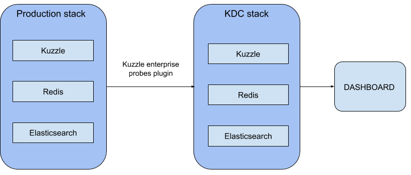
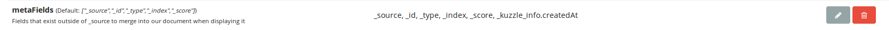

# Visualizing Data with Kuzzle Analytics - part 2


In a [previous article] we demonstrated how to configure Kuzzle Analytics with the probes plugins.
Now we will look at how to configure Kibana to make great visualizations with our data.
Remember, we have two Kuzzle stacks : one for production and another one for collecting data and monitoring events.



Now we want to connect Kibana to our KDC stack in order to create a dashboard with data collected by the probes plugin. Recall that our data was collected using a multi-sensor IoT device placed in our office that captured temperature, humidity, light level and motion. For simplicity, we will prepare a copy of the KDC stack which comes preloaded with the data we collected in Part 1 of this tutorial. This data is embedded in our custom Elasticsearch docker image. For more about the image click [here](https://hub.docker.com/r/kuzzleio/es-tuto-kuzzle-kibana/).

## 1- Update your Docker Compose file

In Part 1 of this series, we created a Docker Compose file that looks like this :

```yaml
version: '2'

services:
  kuzzle:
    image: kuzzleio/kuzzle
    ports:
      - "7512:7512"
    cap_add:
      - SYS_PTRACE
    depends_on:
      - redis
      - elasticsearch
    environment:
      - kuzzle_services__db__client__host=http://elasticsearch:9200
      - kuzzle_services__internalCache__node__host=redis
      - kuzzle_services__memoryStorage__node__host=redis
      - NODE_ENV=production
    volumes:
      - "./plugins/kuzzle-enterprise-probe-listener/:/var/app/plugins/enabled/kuzzle-enterprise-probe-listener/"
      - "./config/kuzzlerc:/etc/kuzzlerc"

  redis:
    image: redis:3.2

  elasticsearch:
    image: kuzzleio/elasticsearch:5.4.1
    environment:
      - cluster.name=kuzzle
      - xpack.security.enabled=false
      - xpack.monitoring.enabled=false
      - xpack.graph.enabled=false
      - xpack.watcher.enabled=false
      - http.host=0.0.0.0
      - transport.host=0.0.0.0
      - "ES_JAVA_OPTS=-Xms1g -Xmx1g"
  
  kdc-kuzzle:
    image: kuzzleio/kuzzle
    ports:
      - "7515:7512"
      - "9229:9229"
    cap_add:
      - SYS_PTRACE
    depends_on:
      - kdc-redis
      - kdc-elasticsearch
    volumes:
      - "./plugins/kuzzle-enterprise-probe:/var/app/plugins/enabled/kuzzle-enterprise-probe/"
      - "./config/kdcrc:/etc/kuzzlerc"
    environment:
      - kuzzle_services__db__client__host=http://kdc-elasticsearch:9200
      - kuzzle_services__internalCache__node__host=kdc-redis
      - kuzzle_services__memoryStorage__node__host=kdc-redis
      - NODE_ENV=production

  kdc-redis:
    image: redis:3.2

  kdc-elasticsearch:
    image: kuzzleio/elasticsearch:5.4.1
    environment:
      - cluster.name=kuzzle
      # disable xpack
      - xpack.security.enabled=false
      - xpack.monitoring.enabled=false
      - xpack.graph.enabled=false
      - xpack.watcher.enabled=false
```

We now want to update the ```kdc-elasticsearch``` service with our custom docker image that contains the data collected from our multi-sensor IoT device :
(on line 60 of our docker-compose.yml file)

```yaml
    image: kuzzleio/es-tuto-kuzzle-kibana
```

ow we can add the Kibana service at the end of the file :

```yaml
  kibana:
    image: docker.elastic.co/kibana/kibana:5.4.1
    environment:
      - SERVER_HOST=0.0.0.0
    volumes:
      - ./kibana.yml:/usr/share/kibana/config/kibana.yml
    ports:
      - 5601:5601
```

If you are a fine observer you may have noticed that we are mounting a volume which contains our own Kibana configuration. Now we need to create this `kibana.yml` file with the following content:

```yaml
server.name: kibana
server.host: "0"
elasticsearch.url: http://kdc-elasticsearch:9200
```

Now you can run the Docker Compose file in your favorite terminal:

```bash
$ docker-compose up
```
If all goes well the terminal should display logs for all the services we just configured. To be sure, you can check if kuzzleis working correctly by opening http://localhost:7512?pretty=true in your favorite browser, you should see a list of routes exposed by Kuzzle.

Your stack is up and ready! Now you can open Kibana and create amazing visualizations!

## 2- Configuring Kibana and Kuzzle

Before we can create charts with Kibana, we need to configure it. Open http://localhost:5601 in a browser to access Kibana’s management page.

First, we need to tell Kibana where to find our timestamps. 

Note that documents sent by our multi-sensor device have a meta field named ```_kuzzle_info.createdAt``` that contains a timestamp for when the data was generated.

```json
{
    "_index":"iot",
    "_type":"device-state",
    "_id":"AWFSDI8RAUgq-wTF-Lwg",
    "_score":1,
    "_source": {
        "device_id":"motion_00000000c9591b74",
        "device_type":"motion-sensor",
        "partial_state":false,
        "state": {
            "motion":true,
        },
        "_kuzzle_info": {
            "author":"iot-device",
            "createdAt":1517834432225,
            "updatedAt":null,
            "updater":null,
            "active":true,
            "deletedAt":null
        }
    }
}
```

To add it to Kibana, click on "Advanced Settings", find the "metaFields" input, and then click the edit button and add `_kuzzle_info.createdAt`. Don't forget to save your changes !



Now we have to specify the index name we want Kibana to use.
Click on "Index Patterns" and type `iot` in the input field. Kibana will automatically find the time based field we just added. Click on "Create" button to validate.


Kibana will now parse every searchable or aggregatable field and show you these fields. 

The next step is to add a scripted field in Kibana. We want to visualize activity based on motion detection so we will focus on the "motion" boolean:

```json
"state": {
  "motion":true
}
```

Unfortunately, only number fields can be aggregated so we need to create a scripted field that converts the boolean to a number.

Click on "scripted fields" tab and on the "Add Scripted Field" button. Give your new field a name, `detected motions` seems nice.
Kibana uses Painless script -that sounds good to my ears. Go to the "Script" textarea and type :

```
doc['state.motion'].value ? 1 : 0
```
You can ignore the other fields.


This will create a new aggregatable field for each document in our index that returns a 1 or 0 depending on the `state.motion` boolean value.

Save the new scripted field. We just completed the Kibana configuration !

## 3- Creating Visualizations and Dashboards

Now to the fun part of this tutorial and the reason you're here ! We're going to create our first graph, ready? Let's go!

Click on the "Visualize" button on the left navigation panel and click "Create a visualization".

We want our first graph to be a bar graph that displays motion over time, so choose "Vertical Bar" and your index by clicking on "iot".

Kibana is a great tool for visualizing data in real-time. However, for the purpose of this tutorial, and to make things easier, we will be working with a static dataset. The first thing we need to do is select a time period. Click on the "time range" button on the top right corner (by default it's set to "Last 15 minutes").
Now click on "Absolute" and choose a range in the date picker. Our preloaded data contains entries from February 2nd, 2018 to February 7th, 2018. Select these dates and then click the "Go" button.


Now that we have selected the data and timeline, we have to configure the graph. First unfold the "Y-axis" menu and select "Sum" as the aggregation type in the dropdown menu. Next we have to choose the field we want to aggregate. Find the `detected motions` field and select it. You can enter a custom label for this aggregation and it will be displayed in the legend of your chart. 


It's time to set up the X-axis, remember we want to display the motion over time, so our X-axis must configured with some kind of timestamp.
Click on the "X-Axis" button and select "Date Histogram". Kibana automatically selects the date field but we have to choose an interval. Pick an hourly interval in the dropdown menu. Give it a custom label if you want, for exemple "Date".


Now click on the "Apply change" button to see our beautiful graph.


Save your new chart by clicking on the save button on the top menu, give it a name and validate.

To finish up, we will add this awsome graph to a dashboard.
Click on the "Dashboard" button on the left navigation panel and click "Create a dashboard".
Like Kibana says: "This dashboard is empty. Let's fill it up!".


Select the visualization we just created and it will be added to our dashboard! 

There you have it, we now have a dashboard with a beautiful graph showing motion activity over time as captured by our multi-sensor IoT device!

Kibana lets you share your dashboard, just copy the URL and send it to your motion detection groupies or add it to your webpage in an iframe.

Feel free to play around with the data to add other wild graphs to the dashboard :-)


