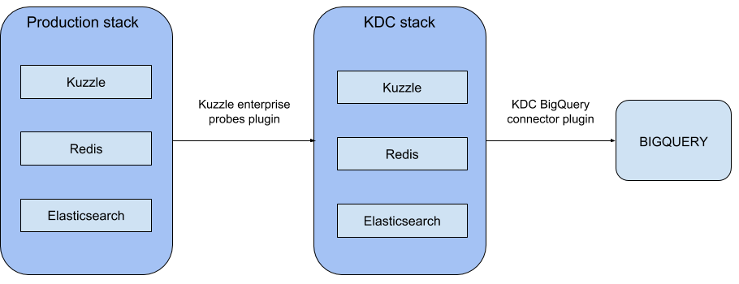

# Visualizing Data with Kuzzle Analytics - part 3


In[Visualizing Data with Kuzzle Analytics - part 2] of this series, we created a dashboard, using Kuzzle Analytics and Kibana, that showed motions captured in our office over time. Now we will configure Kuzzle along with BiqQuery and Data Studio. The goal being to create a meaningful dashboard to visualize luminosity data captured by  multi-sensor IoT device and collected by Kuzzle. Note that Data Studio needs to interface with BigQuery to retrieve data.

To get started, we need to add the KDC-bigquery-connector plugin to our stack.



## 1- Docker-compose and configuration files

First we need to add the KDC-bigquery-connector plugin to our KDC stack in our ```docker-compose.yml``` file.

```yaml
version: '2'

services:
  kuzzle:
    image: kuzzleio/kuzzle
    ports:
      - "7512:7512"
    cap_add:
      - SYS_PTRACE
    depends_on:
      - redis
      - elasticsearch
    environment:
      - kuzzle_services__db__client__host=http://elasticsearch:9200
      - kuzzle_services__internalCache__node__host=redis
      - kuzzle_services__memoryStorage__node__host=redis
      - NODE_ENV=production
    volumes:
      - "./plugins/kuzzle-enterprise-probe-listener/:/var/app/plugins/enabled/kuzzle-enterprise-probe-listener/"
      - "./config/kuzzlerc:/etc/kuzzlerc"

  redis:
    image: redis:3.2

  elasticsearch:
    image: kuzzleio/elasticsearch:5.4.1
    environment:
      - cluster.name=kuzzle
      - xpack.security.enabled=false
      - xpack.monitoring.enabled=false
      - xpack.graph.enabled=false
      - xpack.watcher.enabled=false
      - http.host=0.0.0.0
      - transport.host=0.0.0.0
      - "ES_JAVA_OPTS=-Xms1g -Xmx1g"
  
  kdc-kuzzle:
    image: kuzzleio/kuzzle
    ports:
      - "7515:7512"
      - "9229:9229"
    cap_add:
      - SYS_PTRACE
    depends_on:
      - kdc-redis
      - kdc-elasticsearch
    volumes:
      - "./plugins/kuzzle-enterprise-probe:/var/app/plugins/enabled/kuzzle-enterprise-probe/"
      - "./plugins/kdc-bigquery-connector:/var/app/plugins/enabled/kdc-bigquery-connector/"
      - "./config/kdcrc:/etc/kuzzlerc"
    environment:
      - kuzzle_services__db__client__host=http://kdc-elasticsearch:9200
      - kuzzle_services__internalCache__node__host=kdc-redis
      - kuzzle_services__memoryStorage__node__host=kdc-redis
      - NODE_ENV=production

  kdc-redis:
    image: redis:3.2

  kdc-elasticsearch:
    image: kuzzleio/elasticsearch:5.4.1
    environment:
      - cluster.name=kuzzle
      # disable xpack
      - xpack.security.enabled=false
      - xpack.monitoring.enabled=false
      - xpack.graph.enabled=false
      - xpack.watcher.enabled=false
```

Note that we have added a new volume to mount our second plugin in the  ```kdc-kuzzle``` service.

As I mentioned, this time we want visualize luminosity in Data Studio so we need to update our configuration file to take this change into account.

Here’s example of a document sent by our light sensor:

```JSON
{
  "device_id": "light_lvl_00000000c9591b74",
  "state": {
    "level": 41.47135416666667
  },
  "partial_state": false,
  "device_type": "light-sensor"
}
```

We will need to modify the ```kuzzlerc``` configuration file to add a probe watcher that can collect the ```state.level``` value from each document that matches the following filter:

```json
{
  "plugins": {
    "kuzzle-enterprise-probe-listener": {
      "threads": 1,
      "probes": {
        "probe_watcher_1": {
          "type":"watcher",
          "index": "iot",
          "collection": "device-state",
          "filter": {
            "equals": {
              "device_type": "light-sensor"
            }
          },
          "action": "create",
          "collects": [
            "state.level"
          ]
        }
      }
    }
  }
}
```

Now update the ```kdcrc``` file for the KDC stack configuration:

```json
{
  "plugins": {
    "kuzzle-enterprise-probe": {
      "storageIndex": "iot",
      "probes": {
        "probe_watcher_1": {
          "type":"watcher",
          "index": "iot",
          "collection": "device-state",
          "filter": {
            "equals": {
              "device_type": "light-sensor"
            }
          },
          "action": "create",
          "collects": [
            "state.level"
          ]
        }
      }
    }
  }
}
```

We add the BigQuery plugins configuration in the ```plugins``` portion on the same file. We also need to add our configured probes to this plugin, but this time with the schemas for our BigQuery tables.
Note that if you add ```"timestamp":"true"```, the plugin will automatically add the timestamp for each document collected.

```JSON
    "kdc-bigquery-connector": {
      "projectId": "iot-monitor-192608",
      "dataSet": "probes_iot",
      "credentials": {
        //[...] put your google's credentials here
      },
      "probes": {
        "probe_watcher_1": {
          "timestamp": "true",
          "type": "watcher",
          "tableName": "light_sensor",
          "schema": {
            "fields": [
              {
                "name": "level",
                "type": "FLOAT",
                "mode": "NULLABLE"
              }
            ]
          }
        }
      }
    }
```

We can now run our two stacks with Docker Compose:

```
$ docker-compose up
```

After that, everytime a document is created in the primary stack that matches our probe filter, the ```state.level``` field from this document will be sent to BigQuery. 


## 2- BigQuery and Data Studio

I will assume that you have already configured your google account to use BigQuery (if you want to know more about how to setup BigQuery you can read this [tutorial](https://docs.exploratory.io/import/google-bigquery.html)). You will have to create a new project in BigQuery [console](https://bigquery.cloud.google.com/) and add a new dataset.


It's not necessary to create tables manually in the BigQuery admin console, the Kuzzle BigQuery connector plugin will create them automatically depending on the schema you set in the configuration file.

```JSON
    "schema": {
        "fields": [
            {
                "name": "level",
                "type": "FLOAT",
                "mode": "NULLABLE"
            }
        ]
    }
```

If you add ```"timestamp":"true"``` in the configuration file, the plugin will add a timestamp field to the BigQuery table.

We can now open the Data Studio console here https://datastudio.google.com/. Choose a blank template to start a new report.

Data Studio will ask you to add a data-source. Choose "CREATE NEW DATA SOURCE" and then click on the "ADD TO REPORT" button. 
Now choose BigQuery on the list on left side. Find the project we just created and choose the dataset. Finally, choose the table you want add to Data Studio and click the "CONNECT" button on the top right corner.

You will see a summary of your table (it's possible to change the type of your fields here). We need to tell to Data Studio what kind of aggregation we want for the ```level``` field. By default it's set to "Sum" but we want an "Average" aggregation, so select this option.
Also we want the chart to display the level by hours, so choose "Date Hour" as type for the ```timestamp``` field.


Click the "ADD TO REPORT" button and validate your choice in the modal window.

It's time to add our first chart to this report! Click on the time series button on the top side menu . Draw a frame in the blank zone. Data Studio will automatically set the data source, the dimensions and the metric fields.


That's all folks! We have our chart representing luminosity over time, on an hourly basis.
Of course you can customize your chart, Data Studio offers a large panel of options to render your graph the way you want it.


This was just a short example of what we can do with Data Studio, BigQuery and Kuzzle. We demonstrated how we can use Kuzzle Analytics to easily transfer data to any data visualization system and generate valuable insights.


