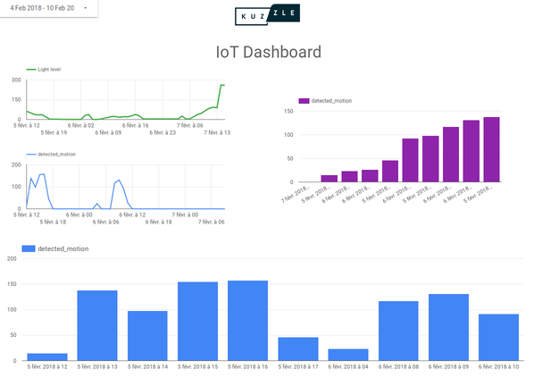
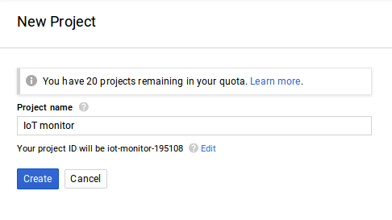
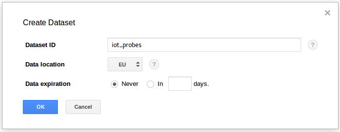
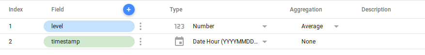
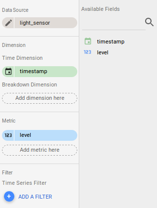
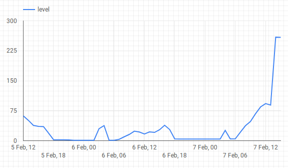

# Visualizing Data with Kuzzle Analytics - part 3



Today we want to configure Kuzzle with BiqQuery and Data-studio with the intention of doing a dashboard to monitor and visualize our datas with Kuzzle and these tools. As you know Data-studio needs to manage data source and for that we will use BigQuery as data warehouse.


## 1- Docker-compose and configuration files


Our light level sensor installed in the IoT board send documents in the Kuzzle primary stack that looks like this :

```JSON
{
  "device_id": "light_lvl_00000000c9591b74",
  "state": {
    "level": 41.47135416666667
  },
  "partial_state": false,
  "device_type": "light_sensor"
}
```

Now, the KDC stack configuration :

```JSON
    "kdc-bigquery-connector": {
      "projectId": "iot-monitor-192608",
      "dataSet": "probes_iot",
      "credentials": {
        //[...] put your google's credentials here
      },
      "probes": {
        "probe_watcher_1": {
          "timestamp": "true",
          "type": "watcher",
          "tableName": "light_sensor",
          "schema": {
            "fields": [
              {
                "name": "level",
                "type": "FLOAT",
                "mode": "NULLABLE"
              }
            ]
          }
        }
      }
    }
```

To the following, we add the BigQuery plugins configuration. We also need to add our configured probes to this plugin. But this time with the schemas of our BigQuery tables.
I add ```"timestamp":"true"```, with this option the plugin will automatically add the timestamp for each document collected.

We can now run our stack with docker in a terminal :

```
$ docker-compose up
```

After that, everytime a document is created in the primary stack and matched with our probe filter, the ```state.level``` field on this document will be send to BigQuery on the appropriate table. 


## 2- BigQuery and Data-studio

Assuming you have already configured your google account for using BigQuery (if you want to know more about how to setup BigQuery you can read this [tutorial](https://docs.exploratory.io/import/google-bigquery.html)). Now, you have to create a new project in BigQuery [console](https://bigquery.cloud.google.com/). And, after that create a new dataset.




You don't have to manually create tables, the Kuzzle BigQuery connector plugin will create them automatically depending on the schema you give in the configuration file.

```JSON
    "schema": {
        "fields": [
            {
                "name": "level",
                "type": "FLOAT",
                "mode": "NULLABLE"
            }
        ]
    }
```

If you add ```"timestamp":"true"``` in the configuration file, the plugin also add a timestamp field to the BigQuery table.

We can go now to the Data-studio console by browsing https://datastudio.google.com/. Choose a blank template to start a new report.

Data-studio will ask you to add a data-source. Choose "CREATE NEW DATA SOURCE" and validate by clicking on the "ADD TO REPORT" button. 
Now choose BigQuery on the list on left side. Find your project we just created and choose the data set. And finnaly choose the table you want add to Data-studio. Validate by clicking on the "CONNECT" button on the top right corner.

You will see a summary of your table (it's possible to change the type of your fields here). We need to tell to Data-studio what kind of aggregation we want for the ```level``` field. By default it's set to "Sum" but we want an "Average" aggregation so, pick this choice.
Also we want the chart is indexing by hours. Choose "Date Hour" for the type of the ```timestamp``` field.



Click on the "ADD TO REPORT" button and validate your choice in the modal window.

It's time to add our first chart to this report ! Click on the time series button on the top side menu . Draw a frame in the blank zone. Data-studio will automatically set the data source, the dimension and the metric fields.



That's all ! We have our chart representing light level over time, sorted hour by hour.
Of course you can customize your chart, Data-studio give a large panel of options to render your graph like another one.



It's just a short exemple of what we can do with Data-studio and BigQuery. But that demonstrate how we can use the Kuzzle enterprise probes system to easily dump datas to another data warehouse in an asynchrone way without interfere with a production stack.

